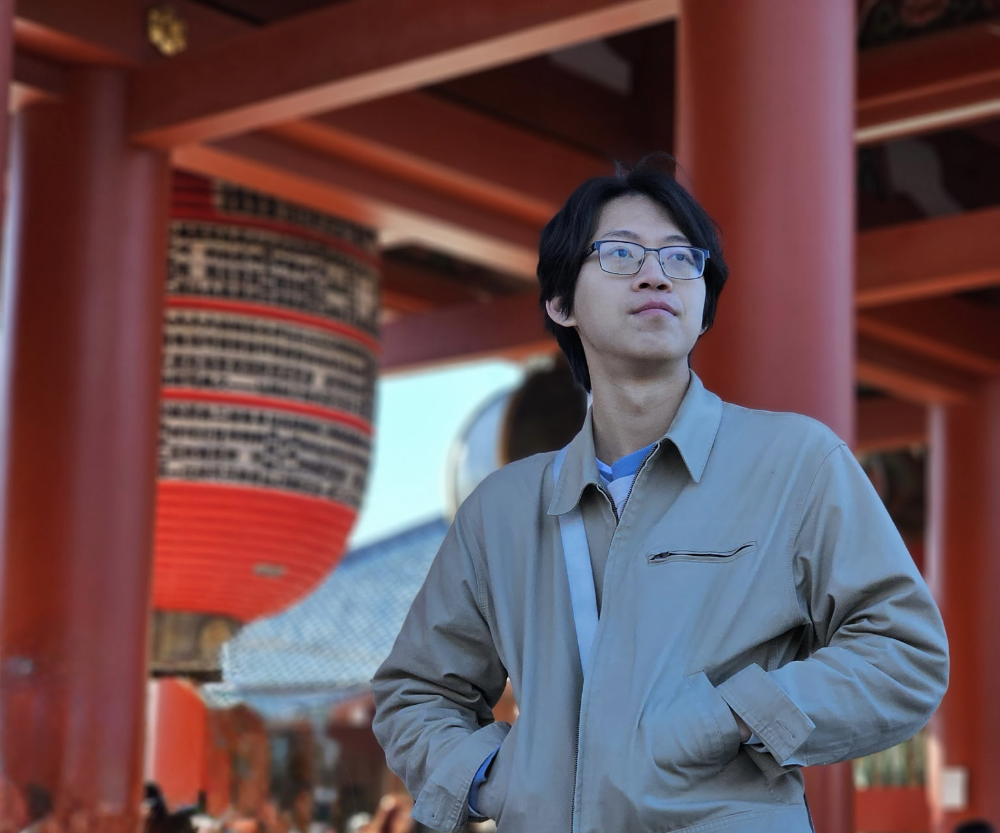

I'm Brendan, a recently graduated Software Engineering student who attended
Chapman University. I'm currently an associate software engineer at Cargill. I'm
also the creator of [OpenAppLock](https://github.com/brendan-ch/OpenAppLock), an
open-source time blocker for iOS,
and [Interchange](https://interchange.bchen.dev), a free shuttle app for Chapman
students.

I believe that no matter which path an app's development takes, it should be
grounded in real experiences.

Feel free to [say hi](mailto:brendan@bchen.dev)!

- [[Projects]]
- [View my resume](/assets/resume.pdf)

