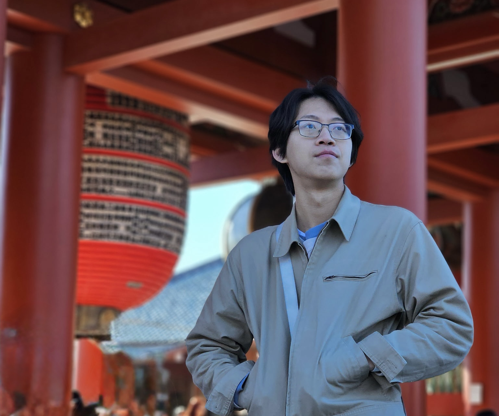

# Brendan Chen

**I'm Brendan, a fourth-year Software Engineering student at [Chapman University](https://chapman.edu/).** I was previously a digital technology intern at [Cargill](https://cargill.com), working within the Branded Feed business to create new digital experiences. I also recently launched [Interchange](https://interchange.bchen.dev), a free app to streamline the college transit experience.

I'm simply interested in creating with software, experimenting with ideas, and learning from others. I view programming and engineering as creative outlets where I can apply my technical expertise to solve traditionally hard problems.

I'm on [GitHub](https://github.com/brendan-ch), [Substack](https://bchendev.substack.com) and [LinkedIn](https://linkedin.com/in/brendan-ch). You may also [email me](mailto:me@bchen.dev).

    <a class="primary-action" href="/projects">View projects</a>
    <a class="secondary-action" href="/assets/resume.pdf" target="_blank">View resume</a>

