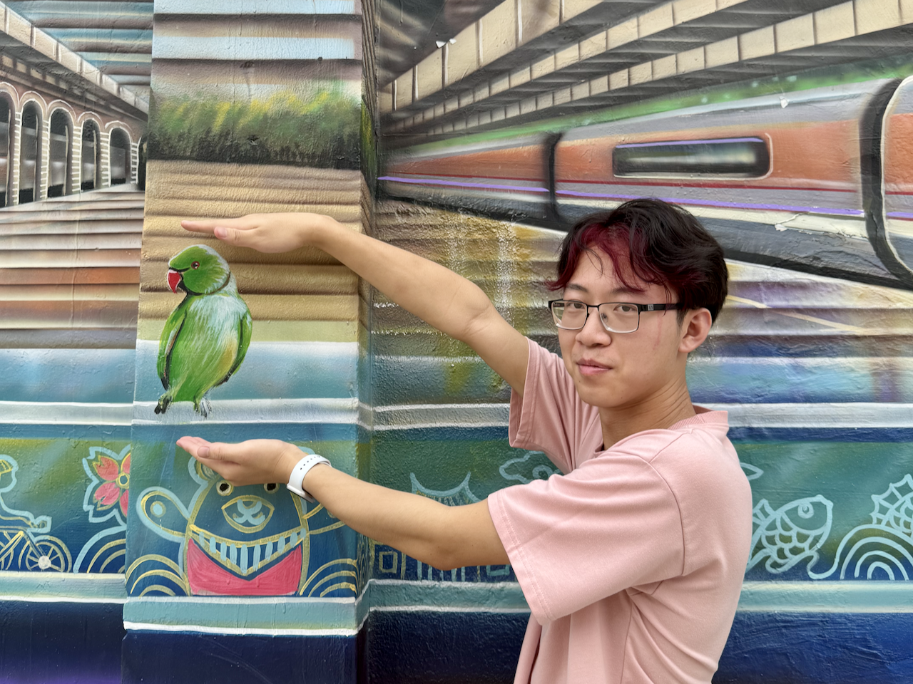

# Brendan Chen

**I'm Brendan, a fourth-year Software Engineering student at 
[Chapman University](https://chapman.edu/).** I'm currently a digital technology intern at [Cargill](https://cargill.com), working within the Branded Feed business to create new digital experiences. I'm also working on [Interchange](https://interchange.bchen.dev), an app to streamline the college transit experience.

I'm simply interested in creating with software, experimenting with ideas, and learning from others. I view programming and engineering as creative outlets where I can put people, both customers and teammates, at the center of everything I do.

## Find me

- [me@bchen.dev](mailto:me@bchen.dev)
- <a href="https://linkedin.com/in/brendan-ch" target="_blank">LinkedIn</a>
- <a href="https://github.com/brendan-ch" target="_blank">GitHub</a>

## More links

- <a href="/assets/resume.pdf" target="_blank">Resume</a>
- [Projects](/projects)
