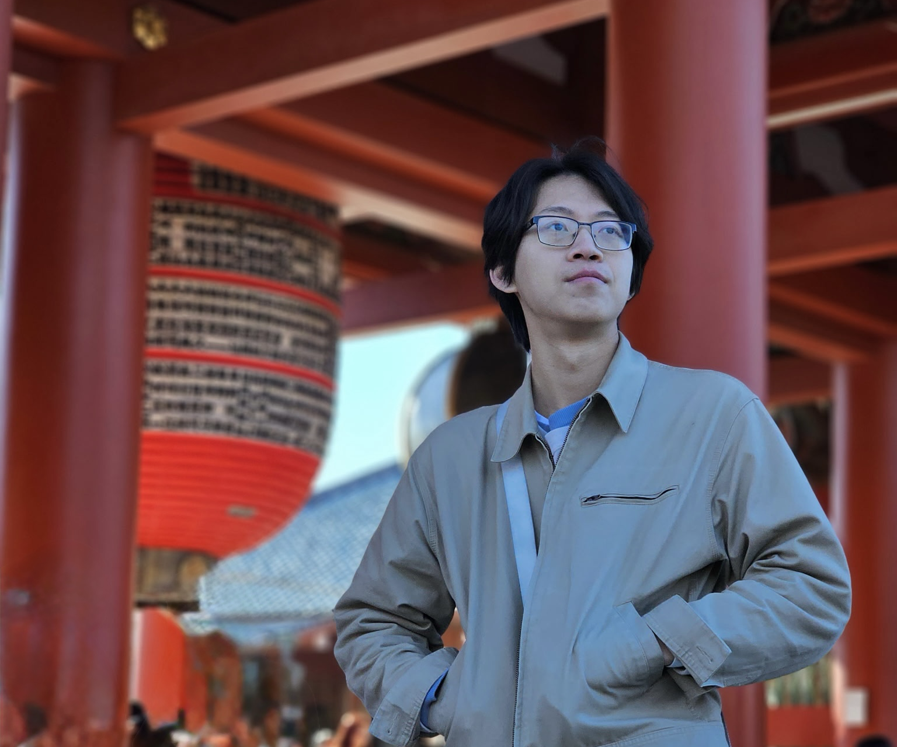

# Brendan Chen

I'm Brendan, a recently graduated Software Engineering student who attended Chapman University. I'm currently an associate software engineer at Cargill. I'm also the creator of [OpenAppLock](https://github.com/brendan-ch/OpenAppLock), an open-source time blocker for iOS, and [Interchange](https://interchange.bchen.dev), a free shuttle app for Chapman students.

In my free time, I build apps and write on my blog, [A New Error](https://newerror.bchen.dev). I believe that no matter which path an app's development takes, it should be grounded in real experiences.

Feel free to [say hi](mailto:brendan@bchen.dev)!

    <a class="primary-action" href="/projects">View projects</a>
    <a class="secondary-action" href="/assets/resume.pdf" target="_blank">View resume</a>

