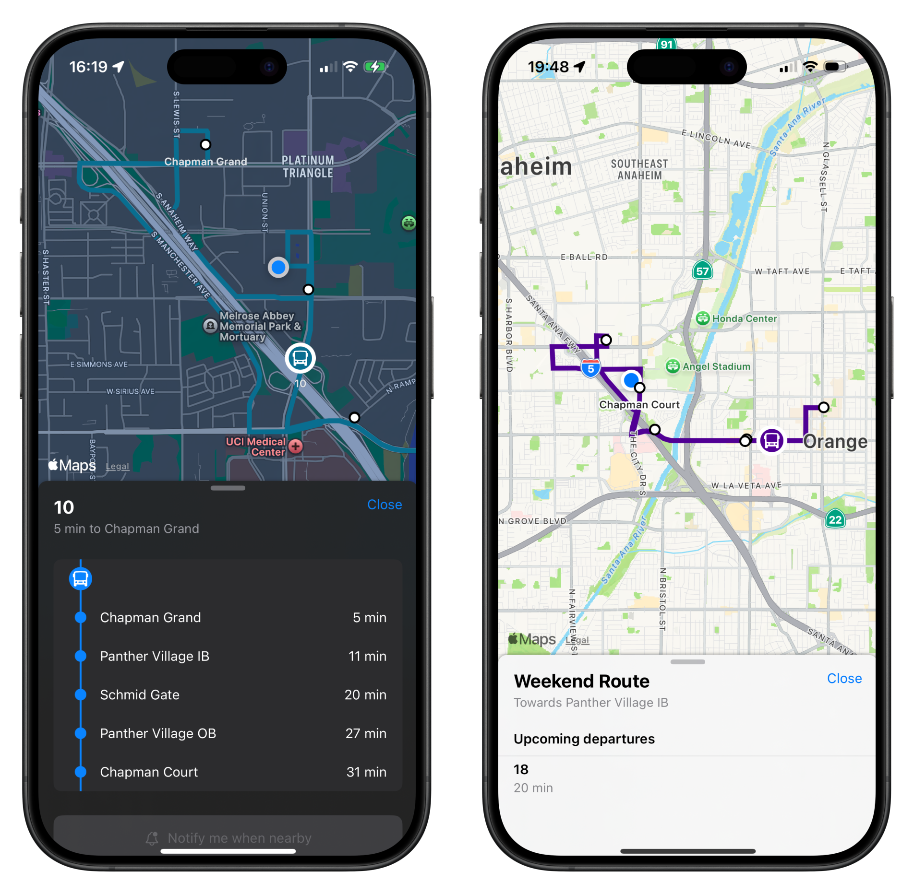

# Projects

## Interchange

**An iOS app for college transit, currently available for Chapman University.** 
View routes, shuttle locations, and estimated arrival times in a sleek, easy-to-use
interface. I built this app to address a gap in user experience, and this is
just the beginning, with much more to come in the future.

- [Join the TestFlight](https://testflight.apple.com/join/HbuHfUgW) and share your feedback today!
- [Website](https://interchange.bchen.dev/)

## Don't Wake Sandie

<iframe style="width: 100%; height: 400px; border-radius: 1px; pointer-events: auto; background-color: white;" src="https://www.linkedin.com/embed/feed/update/urn:li:activity:7274629268624551936?compact=true" frameborder="0" sandbox="allow-scripts allow-popups allow-top-navigation-by-user-activation allow-forms allow-same-origin allow-storage-access-by-user-activation allow-popups-to-escape-sandbox" allowfullscreen=""></iframe>

**A game about not waking up a hungover corgi named Sandie.** Gather 2-4 people,
roll to determine order, and take turns to pet Sandie. Don’t wake her up…*or else*.

I worked on gameplay programming in Unity, and collaborated with 
[Nicole Citardi](https://www.linkedin.com/in/nicole-citardi-16104a222/), 
[Veronica Lan](https://www.linkedin.com/in/veronicalan/), and 
[Daniel Ahn](https://www.linkedin.com/in/daniel-ahn-bb2326262/) to coordinate 
UI development, artwork integration, and version control. There were so many
moving parts, and I really aimed to get as much input for the gameplay design
as I could from the team.

