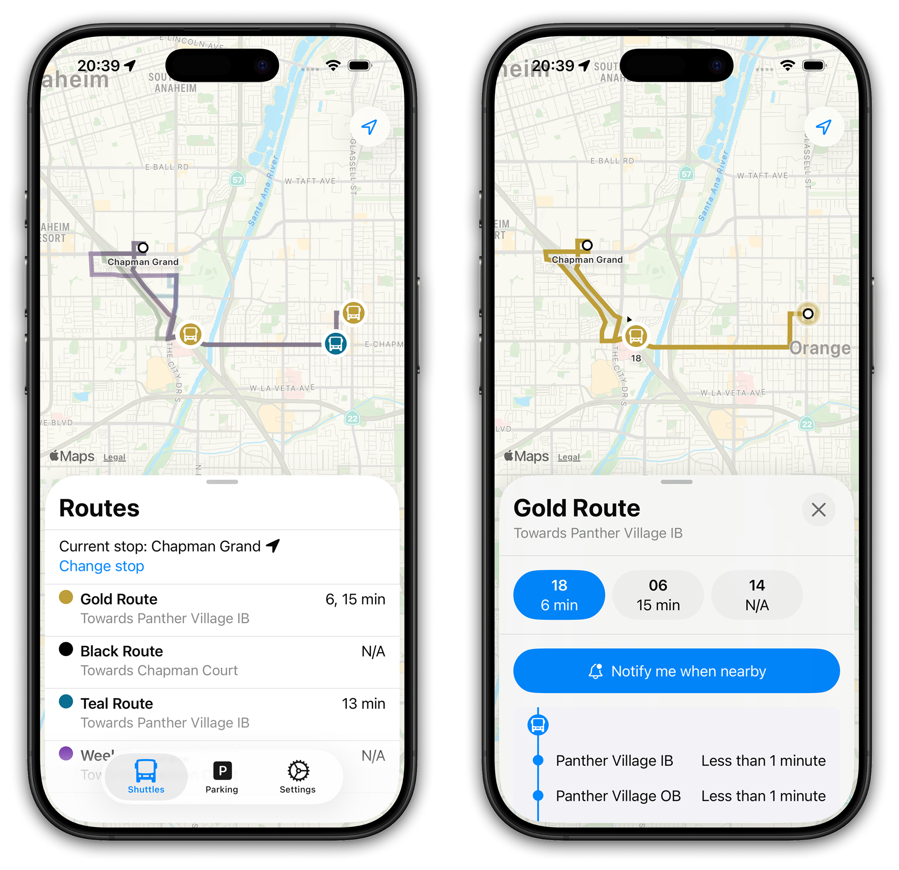

# Interchange

**An iOS app for college transit, currently available for Chapman University.**
View routes, shuttle locations, and estimated arrival times in a sleek,
easy-to-use interface. I built this app using SwiftUI, Node.js and Apollo
GraphQL, with Redis as a primary storage mechanism.

[Download on the App Store](https://apps.apple.com/us/app/interchange-college-commute/id6739968742){: .primary-action }
[Join the TestFlight](https://testflight.apple.com/join/HbuHfUgW){: .secondary-action }
[Website](https://interchange.bchen.dev/){: .secondary-action }
{: .horizontal-wrapper }
