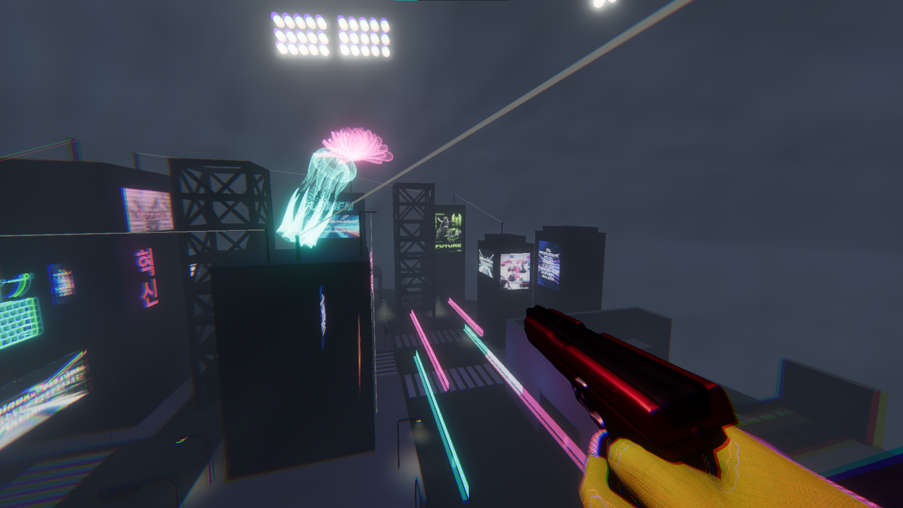

Resonance is a cyberpunk-themed game show shooter. Enter the arena, blast your opponents, and become the star of the show. I worked with a student team of 12 to create this game over multiple months. The game was selected as an **IEEE GameSig finalist**.

*Steam link coming soon!*

My core role was to implement the game's networking logic using PurrNet, an open-source library for Unity.

My first project was to implement networking for **Arena**, a free-for-all PVP game mode, where the player with the most eliminations wins. I learned how to isolate game logic on the server and synchronize state on each client. The networked API for Arena is used by every aspect of the game, including the scoreboard UI and spotlight mechanic. Following a pivot in the game’s core direction, I successfully handed this system to another engineer, who implemented a rating system for style points.

Another project was the **build system**. Having a server dependency and Steam integration meant that the environment differed from development to production. We found it painful to prepare a build for each class-mandated playtest. With the help of Claude, I created a two-step system: an editor script to build and configure dependencies in one step, and a nightly GitHub Actions pipeline. Besides simplifying the build process, this created another positive side effect by ensuring we fixed compiler issues proactively.

I'm currently working on a client-side prediction model for fairer gameplay, more akin to other FPS games on the market.

Even with our team size, the most important thing I learned was how to manage scope and scale. Each one of us pushed ourselves to the limits of our knowledge, going from bare theoretical understanding to practical working implementations. The goal was never to get things right on the first try; it was to learn and realize new ideas in multiple passes.
