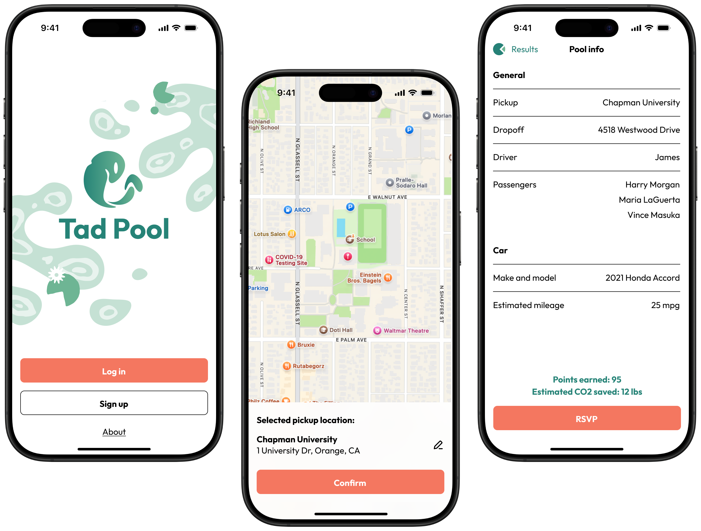

# Tad-Pool

**A mobile app designed to make carpooling easier for college students.** Find
carpools based on time and location, and get rewarded for helping to reduce CO2
emissions. I worked with [Jazmine Stanek](https://www.linkedin.com/in/vjazminestanek/)
and [Isabelle Woo](https://www.linkedin.com/in/isabellewoo/) to create the UI/UX
design using Figma and FigJam, in a period of 24 hours for
[FullyBeyond 2024](https://fullybeyond.acmcsuf.com/).

The project reached the finalist judging stage.

[High-fidelity design](https://www.figma.com/design/nTKCcwftKrg27wlP5mmy9e/Tad-Pool-Design?node-id=13-1837&node-type=canvas&t=YKuVvM6RAPs4hTIo-11){: .primary-action }
[Low-fidelity design](https://www.figma.com/design/nTKCcwftKrg27wlP5mmy9e/Tad-Pool-Design?node-id=0-1&node-type=canvas&t=YKuVvM6RAPs4hTIo-11){: .secondary-action }
[FigJam board](https://www.figma.com/board/Dct7GuhKFYq8maw0KoAVBV/Product-Brainstorm-FullyBeyond?node-id=0-1&node-type=canvas&t=g7RKLLo5IoU84ndk-11){: .secondary-action }
[Devpost](https://devpost.com/software/tad-pool){: .secondary-action }
{: .horizontal-wrapper }
